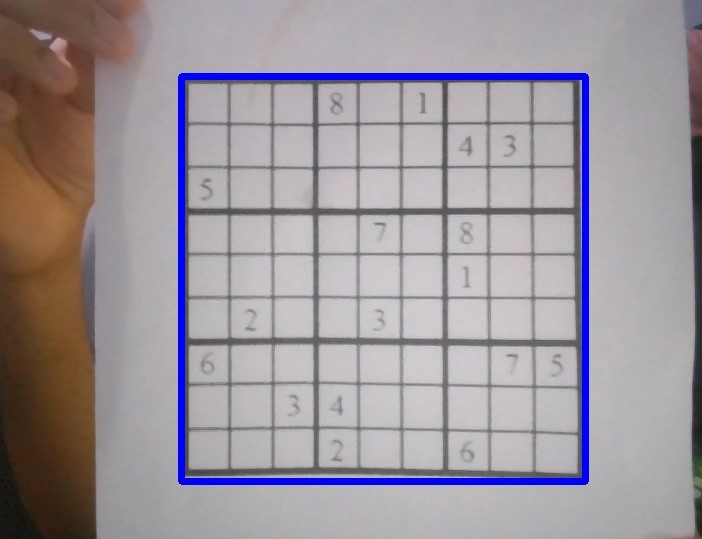
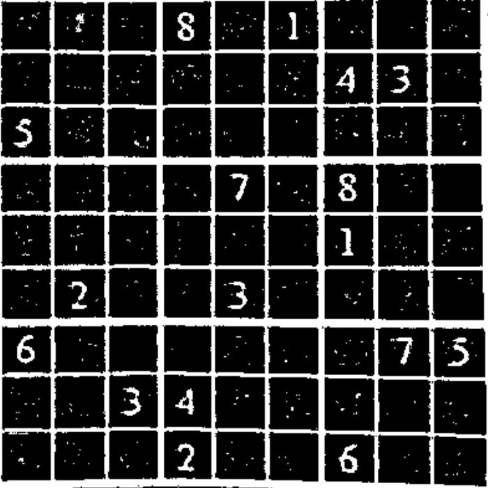

# ARSudokuSolver
This is a basic augmented reality project I picked up to learn more about computer vision and gain experience using the OpenCV library in Python. Upon being shown an incomplete sudoku board on a camera through a live video feed, I augment the missing digits back onto the board in real-time. As I primarily wanted to focus on the computer vision part of this project, I used an existing sudoku solver developed by Alex Beals. That repo can be found here: https://github.com/dado3212/Sudoku-Solver.

# Input / Output

  
  

# Approach Overview
To solve this problem, I first isolate the sudoku board from the rest of the environment. I then evenly split up the board to crop even smaller images of the 81 cells. Using a convolutional neural net trained for 10 potential image inputs (digits from 1-9 as well as a blank input), I was able to determine exactly what digits are present and where they lie on the board. I reformatted this information to fit the sudoku solver and upon parsing the solved return value, I populated the cells with missing digits to produce the final result.

# Image Processing
This project was quite heavy on image processing as I needed to ensure I got the most accurate results for digit localization and recognition. In this subsection, I will briefly go over some of the transformations I applied and explain why I believed they were necessary.

**1. Input Image**  
  
I first converted this input image to grayscale because I intend on applying adaptive thresholding, which is an image transformation which is generally applied to grayscale images.

**2. Grayscale Image**  
  
I want to apply adaptive thresholding to this image to convert it to a binary image, where each pixel is either white or black. This will effectively distinguish the digits and the sudoku board's grid from the whitespace while also ridding the image of small specks of noise.

**3. Adaptive Thresholding**  
  
Evidently, the contours of this image are emphasized much more than the original, especially for the digits.  
  
With these better contours, I can easily find and isolate the sudoku board by searching within image for the contour with the largest area.

**4. Warp Perspective**  
  
I applied a perspective transform here to get a cleanly cropped image of the sudoku board. I could have directly cropped it as well; however, with a perspective transform, I can also correct the cropped image to appear completely flat even if the original image has uneven depth across the board.

**5. Crop Digit**  
  
I applied a perspective transform here to get a cleanly cropped image of the sudoku board. I could have directly cropped it as well; however, with a perspective transform, I can also correct the cropped image to appear completely flat even if the original image has uneven depth across the board.

**5. Clean Digit**  
  
I applied a perspective transform here to get a cleanly cropped image of the sudoku board. I could have directly cropped it as well; however, with a perspective transform, I can also correct the cropped image to appear completely flat even if the original image has uneven depth across the board.

# Disclaimer
